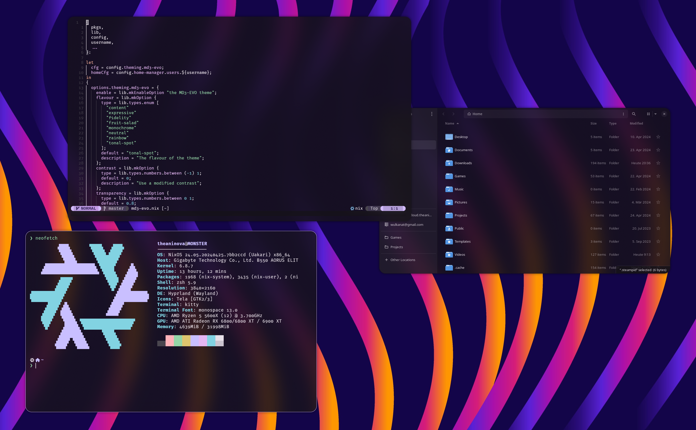
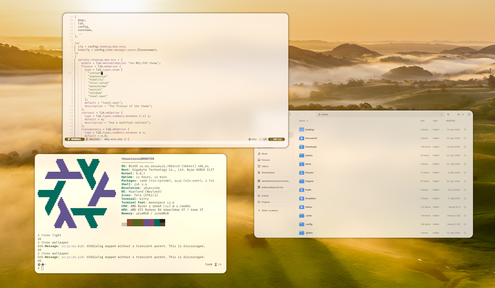

# MD3 Evo Theming

MD3 Evo is a theming system derived from the Material Design 3 color sytem.

<div>
  
  
</div>

## Features

- Wallpaper colors
- Dynamic color and dark mode switching at runtime (no `nixos-rebuild`)
- Dark and light mode support
- User contrast options
- Color flavours
- Faithful ANSI colors that still adapt to your theme
- Static syntax highlighting colors that blends with your theme
- Customizable syntax highlighting tokens
- Transparency and blur support

## CLI Usage

```sh
# Open wallpaper picker
theme wallpaper
# Set wallpaper by path
theme wallpaper ~/Pictures/wallpaper.png
# Switch theme
theme toggle
theme light
theme dark
# Get current theme
theme mode
```

## Integrations

| Name     | Status | Comment                                                                         |
| -------- | ------ | ------------------------------------------------------------------------------- |
| Neovim   | ✅     |                                                                                 |
| Hyprland | ✅     |                                                                                 |
| Kitty    | ✅     | Missing some parts I don't use. Transparency is tinted weirdly for some reason. |
| Anyrun   | ✅     |                                                                                 |
| Vesktop  | 🚧     | Contrast is weird in some places                                                |
| GTK3     | 🚧     |                                                                                 |
| GTK4     | 🚧     | Runtime switching is unreliable                                                 |

## NixOS/Home Manager Module

```nix
# Default options
theming.md3-evo = {
  enable = false;
  flavour = "tonal-spot";
  contrast = 0;
  transparency = 0.8;
  radius = 24;
  padding = 12;
  blur = 16;
  semantic = {
    blend = false;
    danger = "#ff0000";
    warning = "#ffff00";
    success = "#00ff00";
    info = "#0000ff";
  };
  syntax = {
    blend = true;
    keywords = "#ff8000";
    functions = "#0000ff";
    properties = "#ff00ff";
    constants = "#ff00ff";
    strings = "#00ff00";
    numbers = "#00ffff";
    structures = "#ffff00";
    types = "#00ffff";
  };
  ansi = {
    blend = true;
    red = "#ff0000";
    green = "#00ff00";
    yellow = "#ffff00";
    orange = "#ff8000";
    blue = "#0000ff";
    magenta = "#ff00ff";
    cyan = "#00ffff";
  };
};
```
